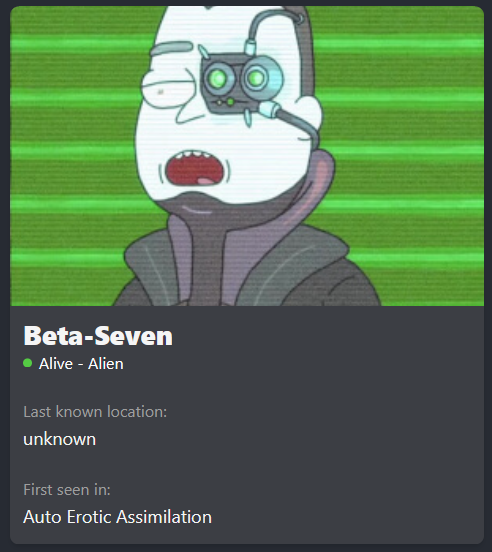

# 

## Materiais GoogleDrive


## Nota final
- A nota final será de no máximo 10 pontos
- Estes pontos serão divididos em:

### 1. Avaliação ao final do Semestre
- Nota máxima 5,00 pontos
- Data da avaliação a ser definida
- Quem define a data da avaliação é a ITE e será postada no calendário da ITE
- Avaliação escrita
  - Poderá ser utilizado os computadores da ITE para a avaliação.
  - Não haverá acesso a internet
  - Não será possível o uso de cosulta
  - É extremamente proibido o uso de celulares ou componentes eletrônicos pessoais
  - A prova deverá ser transcrita a tinta para folha de prova


### 2. Avaliação durante o Semestre
- Nota máxima 5,00 pontos
- A avaliação será feita na forma de trabalho ou avaliação escrita
- INDIVIDUAL

## Datas das aulas
- Haverá aula todos os dias letivos existentes no calendário, salvo exista alguma orientação contrária informada pela ITE ou pelo coordenador.

## Contato com o Professor
- Todo o contato com o professor deverá ser feito através de e-mail [rodrigo.noescobar@gmail.com](mailto:rodrigo.noescobar@gmail.com)
- Não responderei mais perguntas via WhatsApp

## Lista de presença
- Serão feitas duas chamadas, sendo:
    - Primeira entre 19h10 e 20h20, referente a primeira e segunda aula
    - Segunda entre 21h e 22h, referente a terceira e quarta aula
- Dúvidas sobre presença, verificar Regimento Educacional
- Atestados NÃO são dados ao professor e sim a secretaria da ITE

## Avaliação Substitutiva
- Todo o conteúdo será cobrado

## Exame
- TODO o conteúdo será cobrado

## Dúvidas?
- Leia novamente este documento

# Aulas

## Aula02 12/08/2024
- Conhecendo o React (apenas mostrando funcionalidades)
- O que é componente
- Busca à dados externos

## Aula03 19/08/2024
- Trabalhando com Componentes
- Passagem de parâmetros Pai -> Filho
- Passagem de parâmetros Filho Pai
- Exercício: Montagem de tela calculadora

## Aula04 26/08/2024
- Exercício de Calculadora
- Correção do exercício
- Passagem de parametros

## Aula05 02/09/2024
- Consumo de API
- Instalanco biblioteca 

  ``` npm install axios ```
- Exercício 

## Aula06 09/09/2024 - Exercício
Com o conteúdo utilizado na aula 05 (axios), aplique a propriedade CARD do Material UI deixando a imagem de cada personagem da API Ricky and Morty conforme imagem abaixo.



Instalação do Material UI

https://mui.com/material-ui/getting-started/installation/#default-installation

Propriedade CARD

https://mui.com/material-ui/react-card/

## Aula 08 - 23/09/2024
- Trabalhando com Rotas
- localStorage
- Validação simples de login

## Aula 09 - 30/09/2024
- Trabalhando com rotas privadas

## Aula 10 - 07/10/2024
- Trabalho
  - Crie uma aplicação que possua tela de Login, onde o usuário só possa acessar caso ele digite seu usuário e senha
    - O usuário e senha deverá ser o seu RA

  - Após o Login o usuário deverá ser direcionado para um componente chamado Marvel.
  - Está tela deverá possuir uma caixa de texto e um botão buscar.
    - Se o usuário digitar Wolverine e posteriormente clicar em buscar, sua aplicação deverá buscar informações e imagens existentes na API Marvel
    - Da mesma forma, se o usuário digitar Spider-Man as mesmas informaões deverão ser recebidas da API Marvel
    - Exemplo de funcionamento neste [Link](https://snack.expo.dev/@pedrohlopesnvp/exercicio_marvel)
  
  - **Componente Marvel**
    - Utilizando a [API da Marvel](https://developer.marvel.com/)
    - Crie um usuário e senha para você na API, desta forma você receberá uma Public Key e uma Private Key (itens obrigatórios para continuidade do trabalho) [Link](https://developer.marvel.com/signup)
      - Ou no menu principal **Get Key**
    - Para enviar o nome do personagem e receber suas informações, você deverá utilizar a URI **get /v1/public/characters** com o parâmetro **?nameStartsWith**, conforme documentação [Swagger](https://developer.marvel.com/docs)
      - Acesso também pelo menu principal **Interative Documentation**
    - Porém, para acesso a API bem como o resgate das informações, você deverá enviar além do parâmetro **nameStartsWith** os dados:
      - **ts**: que representa o timeStamp atual
      - **hash**: que deverá ser um MD5 do seu **ts** + **privateKey** + **publicKey**
      - **apikey**: sua chave pública

    ```js
    const publicKey = '3d212268eb399a3404abee957ca6ae3e';
    const privateKey = 'd6e5c97bd409375c708f93c4e3399ce1b17fc8de';
    const ts = Date.now();
    const hash = MD5(ts + privateKey + publicKey) //Está função não esta correta, pesquise como fazer;

    const url = "https://gateway.marvel.com/v1/public/characters?nameStartsWith=${name}&ts=${ts}&apikey=${publicKey}&hash=${hash}""; 
    ```

      - Gerando então uma URL parecida com esta
      ```http
        http://gateway.marvel.com/v1/public/comics?nameStartsWith=Spider-Man&ts=1&apikey=1234&hash=ffd275c5130566a2916217b101f26150
      ```   
   
      - (Documentação)[https://developer.marvel.com/documentation/authorization]
  
